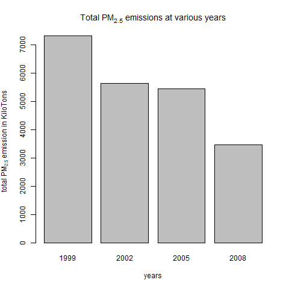
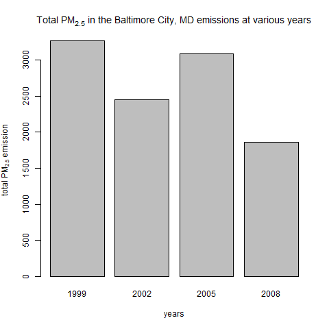
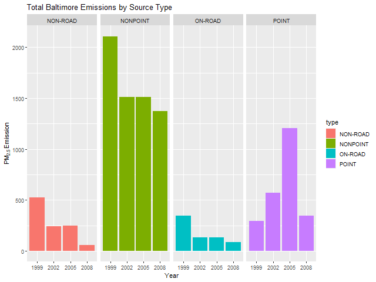
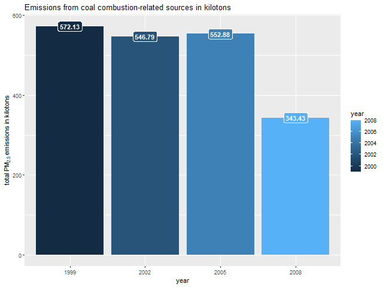
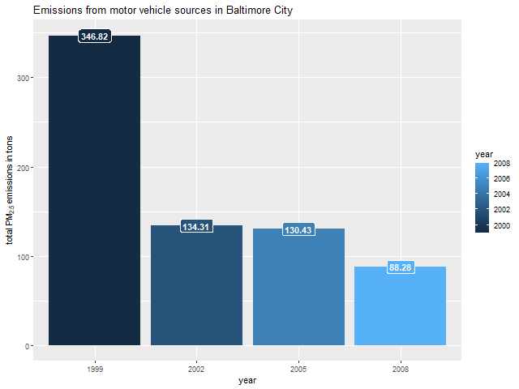
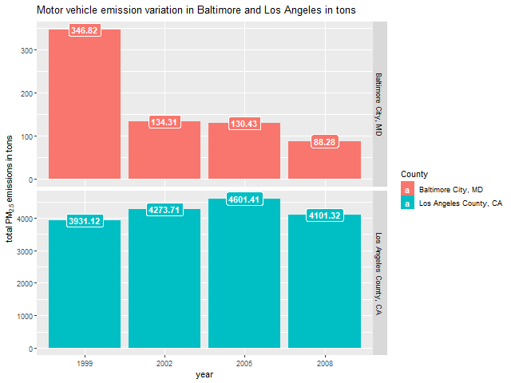

<a href="https://github.com/myrba2win/exploratory-data-analysis-course-project-2">Link to Github Repo</a>
  
  ## Introduction
  
  Fine particulate matter (PM2.5) is an ambient air pollutant for which there is strong evidence that it is harmful to human health. In the United States, the Environmental Protection Agency (EPA) is tasked with setting national ambient air quality standards for fine PM and for tracking the emissions of this pollutant into the atmosphere. Approximatly every 3 years, the EPA releases its database on emissions of PM2.5. This database is known as the National Emissions Inventory (NEI). You can read more information about the NEI at the <a href="http://www.epa.gov/ttn/chief/eiinformation.html">EPA National Emissions Inventory web site.</a>

For each year and for each type of PM source, the NEI records how many tons of PM2.5 were emitted from that source over the course of the entire year. The data that you will use for this assignment are for 1999, 2002, 2005, and 2008.

## Data handling

<a href="https://d396qusza40orc.cloudfront.net/exdata%2Fdata%2FNEI_data.zip">Data for  Assessment </a>[29Mb]
<br>
  The zip file contains two files:
  PM2.5 Emissions Data (summarySCC_PM25.rds): This file contains a data frame with all of the PM2.5 emissions data for 1999, 2002, 2005, and 2008. For each year, the table contains number of tons of PM2.5 emitted from a specific type of source for the entire year. 

<ul>
  <li><b>fips:</b> A five-digit number (represented as a string) indicating the U.S. county</li>
  <li><b>SCC:</b> The name of the source as indicated by a digit string (see source code classification table)</li>
  <li><b>Pollutant:</b> A string indicating the pollutant</li>
  <li><b>Emissions:</b> Amount of PM2.5 emitted, in tons</li>
  <li><b>type:</b> The type of source (point, non-point, on-road, or non-road)</li>
  <li><b>year:</b> The year of emissions recorded</li>
  </ul>
  
  Source Classification Code Table (Source_Classification_Code.rds): This table provides a mapping from the SCC digit strings in the Emissions table to the actual name of the PM2.5 source. The sources are categorized in a few different ways from more general to more specific and you may choose to explore whatever categories you think are most useful. For example, source “10100101” is known as “Ext Comb /Electric Gen /Anthracite Coal /Pulverized Coal”.

<b> How the Source Classification Codes were determined for Plots 3-6:</b>
  <p>   This snippet of code is only for filtering on Coal Combustion (Plot 4).</p>
  
  ```
# Levels go from generic (SCC.Level.One) to specific (SCC.Level.Four)
# data only exists for "coal" in the SCC.Level.Four and SCC.Level.Three and EI.Sector
# After analysis, Short.Name by "comb" and SCC.Level.Four by "coal" 

# Uncomment to see the unique values in Short.Name and SCC.Level.Four BEFORE filtering
# print(unique(SCC[grepl("coal|comb",SCC$Short.Name, ignore.case=TRUE),]$Short.Name)))
# print(unique(SCC[grepl("coal",SCC$Short.Name, ignore.case=TRUE),]$Short.Name)))

# Filter on Short.Name
data_coal_comb <- SCC[grepl("coal|comb",SCC$Short.Name, ignore.case=TRUE),]

# Filter again on SCC.Level.Four
scc_list <- data_coal_comb[grepl("coal",data_coal_comb$SCC.Level.Four, ignore.case=TRUE),]

# Uncomment to see what was filtered out the second time
# d <- setdiff(data_coal_comb, scc_list)
# unique(d$Short.Name)

# Take SCC codes we grepped for and pull NEI data containing the SCC code
# filteredNEI data is ready for plotting
filteredSCC <- SCC[scc_list$SCC,]$SCC
filteredNEI <- NEI[NEI$SCC %in% filteredSCC,]
```

# Plots and Analysis
## Plot 1 
<b>Question:</b> Have total emissions from PM2.5 decreased in the United States from 1999 to 2008? Using the base plotting system, make a plot showing the total PM2.5 emission from all sources for each of the years 1999, 2002, 2005, and 2008.

<b>Analysis:</b> The total PM2.5 emissions across the United States has decreased from 1999 to 2008. The total emissions stabilized from 2002 to 2005 but significantly decreased from 2005-2008. 

 


## Plot 2 
<b>Question:</b> Have total emissions from PM2.5 decreased in the Baltimore City, Maryland (fips=="24510") from 1999 to 2008? Use the base plotting system to make a plot answering this question.

<b>Analysis:</b> Ultimately, emissions in Baltimore City, MD have decreased from 1999 to 2008 but it was not a stable decrease in emissions with a spike in 2005.

 


## Plot 3 
<b>Question:</b> Of the four types of sources indicated by the <b>type</b> (point, nonpoint, onroad, nonroad) variable, which of these four sources have seen decreases in emissions from 1999–2008 for Baltimore City? Which have seen increases in emissions from 1999–2008? Use the ggplot2 plotting system to make a plot answer this question.

<b>Analysis:</b> Emissions from on-road, non-point, and on-road sources all significantly decreased from 1999 to 2008. The only source that increased emissions slightly was from the point source. 

 


## Plot 4 
<b>Question:</b> Across the United States, how have emissions from coal combustion-related sources changed from 1999–2008?
  
  <b>Analysis:</b> Emissions across the United States related to coal combustion has decreased from 1999 to 2008.

 


## Plot 5 
<b>Question:</b> How have emissions from motor vehicle sources changed from 1999–2008 in Baltimore City?
  
  <b>Analysis:</b> Emissions in Baltimore City, MD related to motor vehicle sources has steadily decreased from 1999 to 2008.

 


## Plot 6 
<b>Question:</b> Compare emissions from motor vehicle sources in Baltimore City with emissions from motor vehicle sources in Los Angeles County, California (fips=="06037"). Which city has seen greater changes over time in motor vehicle emissions?
  
  <b>Analysis:</b> Emissions related to motor vehicle sources in Baltimore City vs Los Angeles has stark differences. Emmissions from Los Angeles heavily over power emissions from Balitimore City. Los Angeles has not decreased motor vehicle emissions at all from 1999 to 2008 while Baltimore City decreased emissions by over half.

 